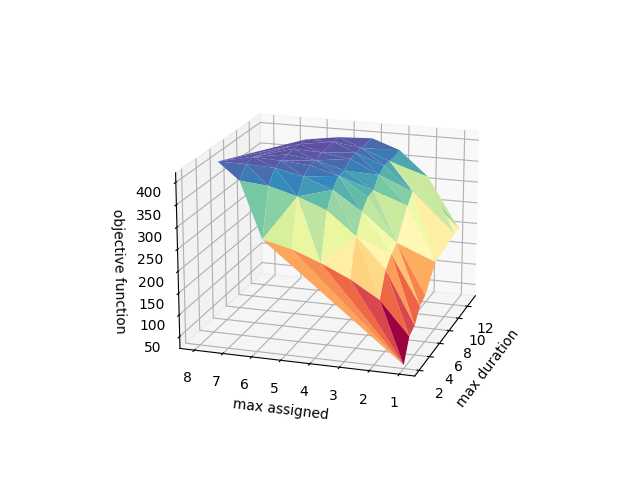

# CompuOpti

## :book: Description

This project aims at optimizing the planning of a fictional company, CompuOpti, for the realization of a number of projects, with numerous constraints concerning the workers, their skills and the work days. It has been realized as part of the Decision Modelling course of CentraleSupélec. The details are provided (in French) [here](/home/guillaume/Documents/CompuOpti/Projet_SDP_2022_23.pdf).

## :busts_in_silhouette: Team Members

- Thomas Brilland
- Guillaume Dugat
- Sacha Muller

## :file_folder: Structure of the repository

The repository is made up with three jupyter notebooks, `plannings_modeling.ipynb`, `surface_plot.ipynb` and `preference_model.ipynb`, that enable to show visually our results and understand our work, a folder `src` that contains the code, a folder `instances` that constains examples of instances and a folder `results` to store raw results of computations.

## :hammer: Installation

To install the project, you need to install gurobi optimizer and some basic python libraries that can be installed easily using pip.

## :ferris_wheel: Usage

The notebooks have been designed to be used easily. You can modify the instance name at the begining and run them on different instances.
